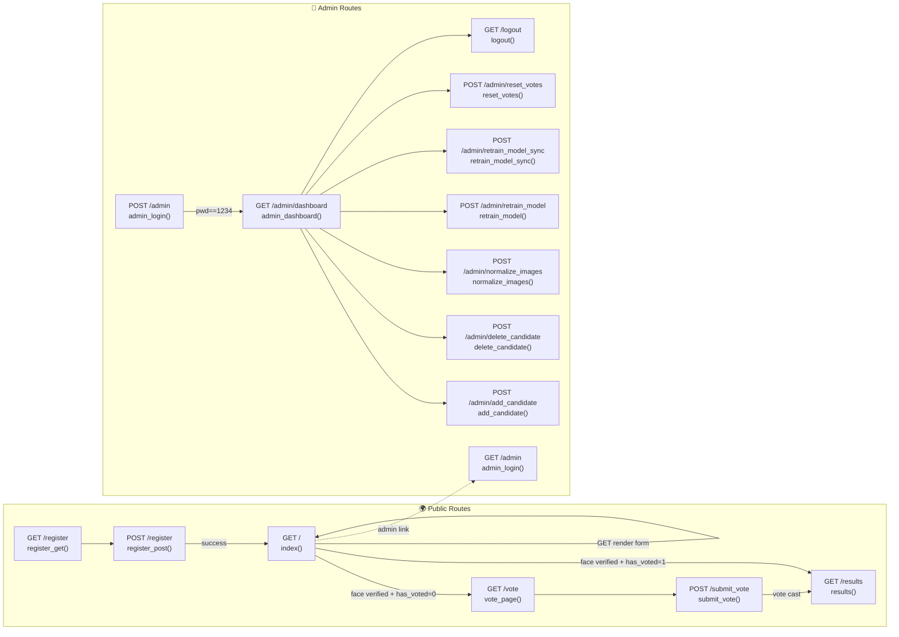
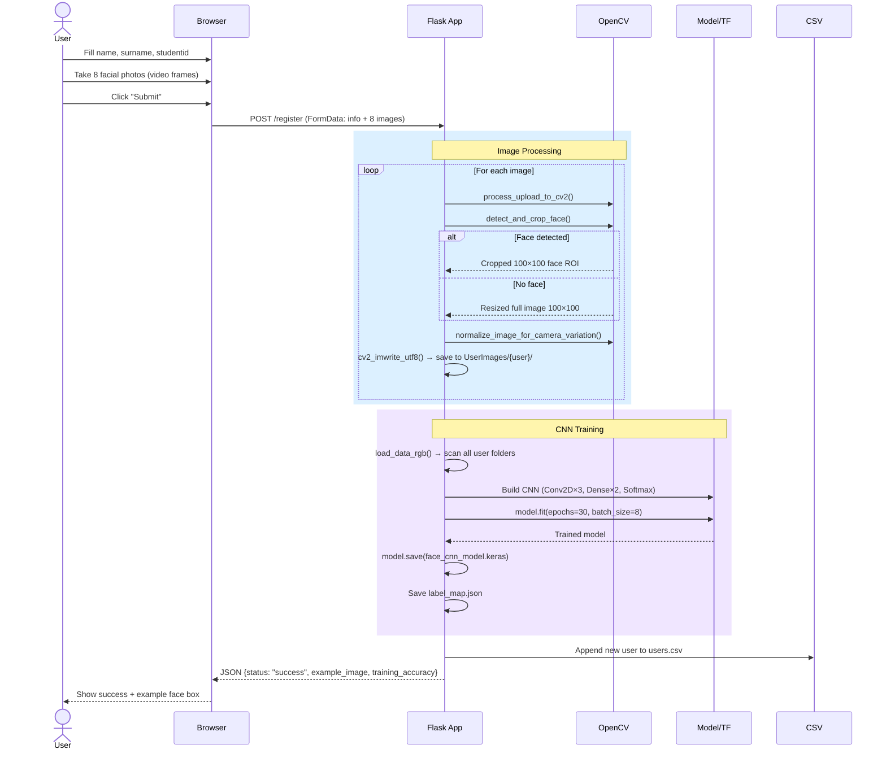
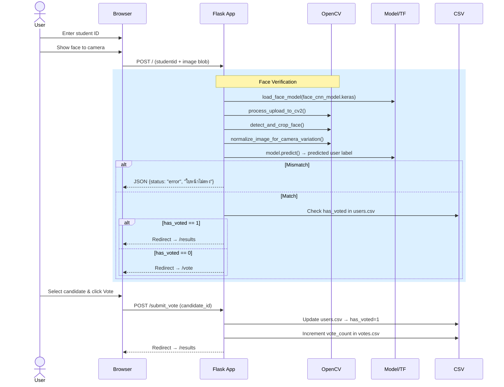
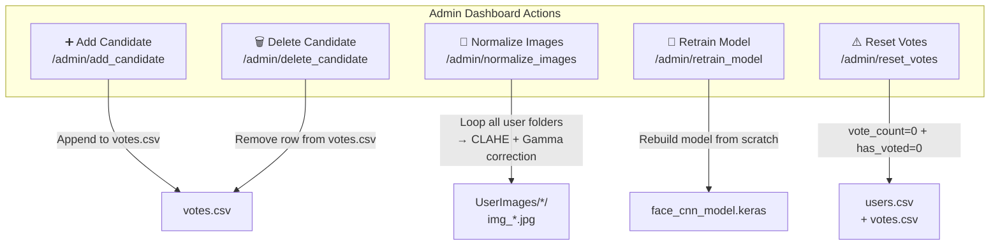

# 🌐 ElectionAppFinalMix — Codebase Graph / Architecture Diagram

> Generated by Cline AI — **2026-06-19**
> A Flask‑based election system with **face‑recognition login**, admin dashboard, and real‑time voting results.

---

## 📁 1. Project Directory Structure

```
ElectionAppFinalMix/
│
├── app.py                          # 🧠 Main Flask app (all routes, CNN model, image processing)
├── requirements.txt                # 📦 Python dependencies
├── CLAUDE.md                       # 📘 Guidance for Claude Code
├── GEMINI.md                       # 📘 @CLAUDE.md alias
├── SKILL.md                        # 📘 Skill reference doc
├── history.md                      # 📝 Modification history
├── test_payload.json               # 🧪 Graphify test payload
├── .graphifyignore                 # 🚫 Graphify ignore rules
├── run_graphify.bat                # ⚙️ Graphify batch runner
├── run_graphify_bg.py              # ⚙️ Graphify background runner
├── graphify-out/                   # 📂 Graphify output cache
├── haarcascade_frontalface_default.xml  # 📷 Haar Cascade detector
│
├── templates/                      # 🎨 HTML Templates (Jinja2)
│   ├── index.html                  #   ├─ Login / Face verification
│   ├── register.html               #   ├─ User registration (8 photos)
│   ├── vote.html                   #   ├─ Voting ballot page
│   ├── result.html                 #   ├─ Real‑time results table
│   ├── admin_login.html            #   ├─ Admin login portal
│   └── admin_dashboard.html        #   └─ Admin dashboard & tools
│
└── Face_Recog_App/                 # 📂 Face recognition assets
    ├── model/                      #   ├─ Trained models & data
    │   ├── face_cnn_model.keras    #   │  └─ 🧠 Saved CNN model
    │   ├── label_map.json          #   │  └─ 🏷️ User‑name → ID mapping
    │   ├── train.log               #   │  └─ 📋 Training logs
    │   ├── yolov8n-face.pt         #   │  └─ 🔬 Optional YOLO face model
    │   └── best model/             #   │  └─ 🏆 Legacy backups
    │
    └── static/uploads/UserImages/  #   └─ 📸 User image storage
        ├── users.csv               #      ├─ User registry
        ├── votes.csv               #      └─ Vote tally
        └── {name}_{surname}/       #         └─ Each user's 8 images
```

---

## 🏗️ 2. High‑Level Architecture

```mermaid
graph TB
    subgraph "🌐 Web Layer (Flask)"
        APP["app.py<br/>Flask Application"]
        TEMPLATES["templates/<br/>Jinja2 HTML"]
        SESSION["Flask Session<br/>Cookie‑based Auth"]
    end

    subgraph "🖼️ Image Processing"
        CV2["OpenCV (cv2)"]
        HAAR["Haar Cascade<br/>face_cascade.detectMultiScale()"]
        YOLO_MODEL["YOLOv8‑face<br/>ultralytics (optional)"]
        NORM["normalize_image_for_camera_variation()<br/>CLAHE + Gamma"]
    end

    subgraph "🧠 ML / Face Recognition"
        TF["TensorFlow / Keras"]
        CNN["CNN Model<br/>Sequential Conv2D"]
        MODEL_FILE["face_cnn_model.keras"]
        LABEL_MAP["label_map.json"]
        TRAIN["retrain_face_model_from_existing_images()"]
    end

    subgraph "💾 Data Persistence"
        CSV_USERS["users.csv<br/>User Registry"]
        CSV_VOTES["votes.csv<br/>Vote Counts"]
        IMG_STORE["UserImages/{user}/<br/>8 × img_*.jpg"]
        TRAIN_LOG["train.log"]
    end

    subgraph "🔐 Auth & Access"
        ADMIN_PWD["ADMIN_PASSWORD<br/>Hardcoded: 1234"]
        SESSION_VARS["session['studentid']<br/>session['is_admin']"]
    end

    APP -->|"render_template()"| TEMPLATES
    APP -->|"session[]"| SESSION
    APP -->|"detect_faces()"| HAAR
    APP -->|"detect_faces() fallback"| YOLO_MODEL
    APP -->|"cv2_imread_utf8 / cv2_imwrite_utf8"| CV2
    APP -->|"normalize_image_for_camera_variation()"| NORM
    APP -->|"load_face_model() / model.fit()"| TF
    TF -->|"load_model / save"| MODEL_FILE
    APP -->|"load_data_rgb()"| IMG_STORE
    APP -->|"pd.read_csv / to_csv"| CSV_USERS
    APP -->|"pd.read_csv / to_csv"| CSV_VOTES
    APP -->|"write_train_log()"| TRAIN_LOG
    APP -->|"verify password"| ADMIN_PWD
    APP -->|"session check"| SESSION_VARS
    TF --> CNN
    TRAIN -->|"rebuilds"| MODEL_FILE
```



---

## 🧭 3. Flask Route Map



---

## 🔄 4. Data Flows

### 4a. 👤 User Registration Flow



### 4b. 🔑 Face Login → Vote Flow



### 4c. 🔧 Admin Operations



---

## 🧠 5. CNN Model Architecture

```
┌──────────────────────────────────────────────────────────────┐
│                    INPUT (100×100×3 RGB)                      │
└──────────────────────────────────────────────────────────────┘
                              │
                    ┌─────────▼─────────┐
                    │   Conv2D 32×(3×3)  │
                    │ BatchNormalization │
                    │  Activation('relu')│
                    │  MaxPooling2D(2×2) │
                    │    Dropout(0.2)    │
                    └─────────┬─────────┘
                              │
                    ┌─────────▼─────────┐
                    │   Conv2D 64×(3×3)  │
                    │ BatchNormalization │
                    │  Activation('relu')│
                    │  MaxPooling2D(2×2) │
                    │    Dropout(0.2)    │
                    └─────────┬─────────┘
                              │
                    ┌─────────▼─────────┐
                    │  Conv2D 128×(3×3)  │
                    │  Activation('relu')│
                    │  MaxPooling2D(2×2) │
                    │    Dropout(0.2)    │
                    └─────────┬─────────┘
                              │
                    ┌─────────▼─────────┐
                    │      Flatten       │
                    └─────────┬─────────┘
                              │
                    ┌─────────▼─────────┐
                    │   Dense 128 units  │
                    │  Activation('relu')│
                    │    Dropout(0.5)    │
                    └─────────┬─────────┘
                              │
                    ┌─────────▼─────────┐
                    │  Dense N units     │
                    │ Activation(softmax)│
                    └─────────┬─────────┘
                              │
                    ┌─────────▼─────────┐
                    │   Predicted User   │
                    └───────────────────┘

    Optimizer:  Adam
    Loss:       sparse_categorical_crossentropy
    Epochs:     30
    Batch Size: 8
```

---

